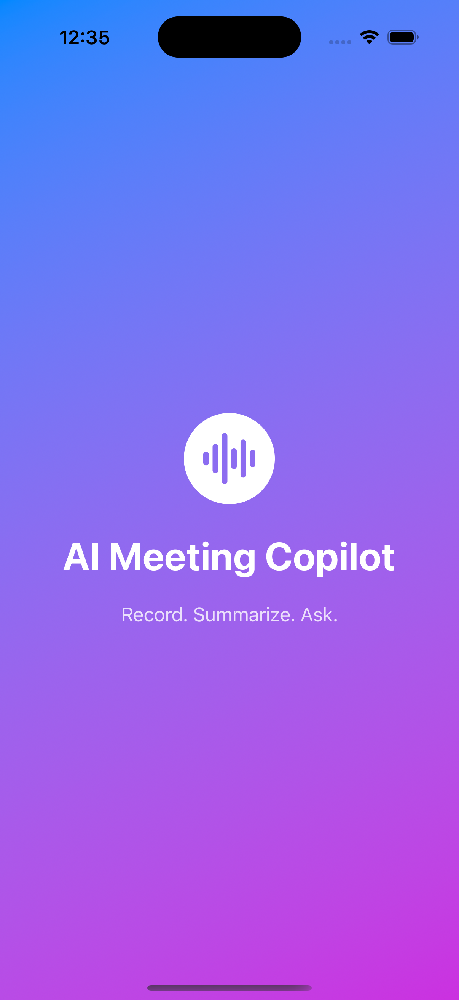
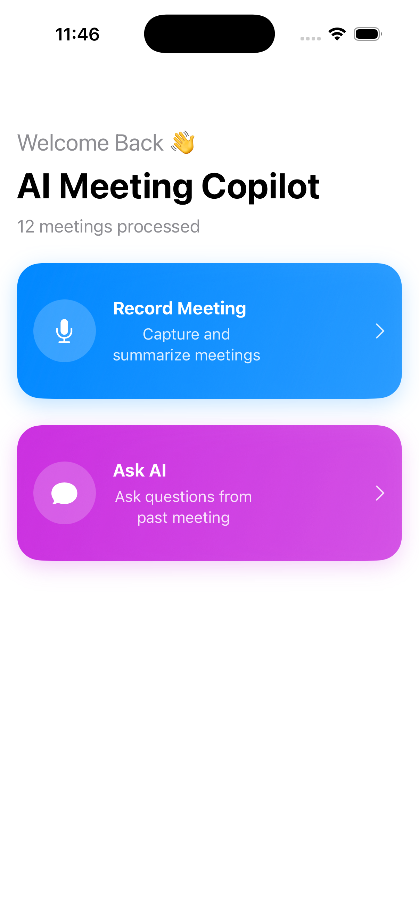
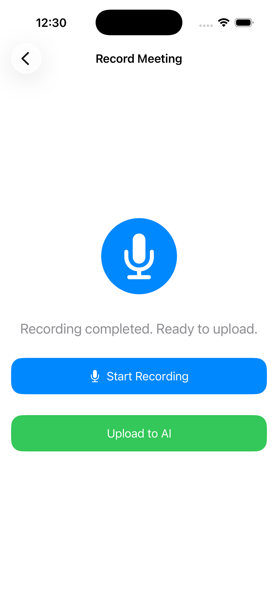
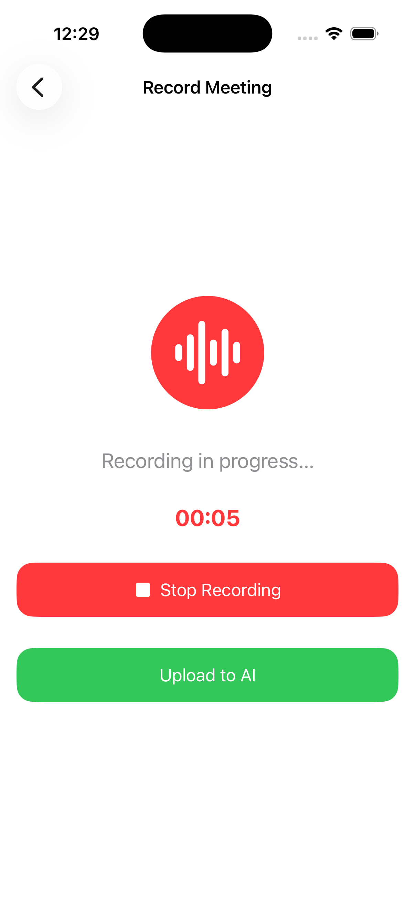
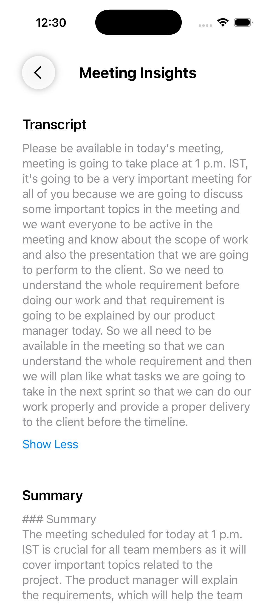
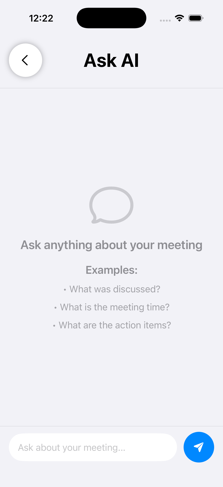
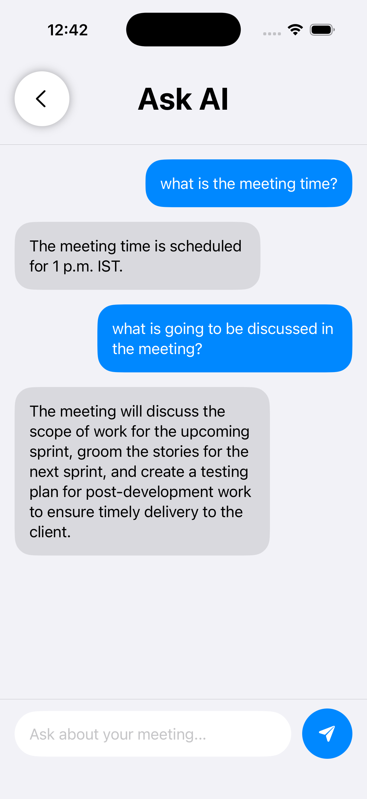

#AI Meeting Copilot – iOS App

AI Meeting Copilot iOS is a SwiftUI-based mobile application that enables users to record meetings, upload audio to an AI-powered backend, receive structured summaries, and interact with meeting content using contextual AI chat powered by Generative AI and Retrieval-Augmented Generation (RAG) workflows.

The app is designed using clean MVVM architecture, modular services, reusable UI components, async/await concurrency, and production-style backend integration.

Project Overview

The iOS application acts as the frontend client for the AI Meeting Copilot platform.

It handles:

Audio recording
Microphone permission handling
File upload to backend
Meeting summary visualization
AI chat interaction
Meeting history access
Persistent local meeting context
Error handling
State-driven UI updates

The application communicates with a FastAPI backend deployed in cloud infrastructure.

#Core Features
1. Audio Recording

Users can record meeting conversations directly from the iOS application.

Capabilities
Microphone permission handling
Start recording
Stop recording
Local temporary audio file generation
Upload-ready audio preparation
2. Upload Audio to AI Backend

Recorded audio is uploaded to the backend API.

The backend processes:

Speech-to-text transcription
AI summarization
Action item extraction
Key decision extraction

The application then renders structured meeting insights.

3. AI Meeting Summary

After processing, users receive:

Transcript
Summary
Action items
Key decisions

This converts raw meeting conversations into structured business insights.

4. Ask AI (Meeting Chat)

Users can ask contextual questions based on meeting content.

Example questions
What was discussed?
What decisions were made?
What are the next steps?
Were blockers identified?

The app integrates with backend Generative AI and Retrieval-Augmented Generation (RAG) services for contextual AI-powered responses.

5. Meeting State Persistence

The application stores local meeting context for smoother user experience.

Used for:

Current meeting tracking
Last uploaded meeting
Chat continuity
Navigation state persistence
6. Error Handling

Implemented for:

Upload failures
Missing data
Invalid responses
API failures
Network issues
Permission denial

This improves application reliability and user experience.

7. Clean Modular UI

Views are separated into reusable components for maintainability.

Includes:

Dashboard
Recording
Processing
Summary
Chat
Reusable cards
Tech Stack
Language
Swift 5
UI Framework
SwiftUI
Architecture
MVVM (Model View ViewModel)
Networking
URLSession
REST API Integration
AI Integration
Generative AI
Retrieval-Augmented Generation (RAG)
Contextual AI Chat
Semantic Retrieval Workflows
Storage
AppStorage
Local persistence
Audio
AVFoundation
Concurrency
Async/Await
Testing
XCTest
MockURLProtocol
Architecture Flow
User
   ↓
SwiftUI View
   ↓
ViewModel Layer
   ↓
Service Layer
   ↓
REST API Calls
   ↓
FastAPI Backend
   ↓
AI Processing
   ↓
Response Mapping
   ↓
UI Rendering
Key Functional Flow
Meeting Upload Flow
Record Audio
   ↓
Save Local File
   ↓
Upload API
   ↓
Backend Processing
   ↓
Transcript
   ↓
Summary
   ↓
Action Items
   ↓
Key Decisions
   ↓
Display in UI
Ask AI Flow
Meeting Selected
   ↓
User Question
   ↓
POST /chat
   ↓
AI Answer
   ↓
Chat Rendering
Major Screens
Dashboard

Main landing screen.

Provides access to:

Record Meeting
Upload Flow
Ask AI
Meeting Summary
Recording Screen

Handles:

Microphone permission request
Start recording
Stop recording
Recording state management
Processing Screen

Displays:

Upload progress
AI processing state
Loading feedback
Summary Screen

Displays:

Transcript
Summary
Action items
Key decisions
Ask AI Screen

Provides chat-based interaction for contextual meeting understanding.

Project Structure
AIMeetingCopilot/
│
├── Models/
│   ├── UploadResponse.swift
│   ├── ChatRequest.swift
│   ├── ChatResponse.swift
│   └── ChatMessage.swift
│
├── ViewModels/
│   ├── MeetingViewModel.swift
│   └── RecordingViewModel.swift
│
├── Services/
│   ├── APIService.swift
│   ├── UploadService.swift
│   └── AudioRecorderService.swift
│
├── Views/
│   ├── SplashView.swift
│   ├── RecordingView.swift
│   ├── ProcessingView.swift
│   ├── ChatView.swift
│   └── DashboardCard.swift
│
├── Utilities/
│   ├── AppStorageManager.swift
│   └── AppError.swift
│
└── AIMeetingCopilotApp.swift
Important Components
APIService

Responsible for:

Generic backend API communication
Response decoding
Error handling
UploadService

Responsible for:

Multipart upload
Audio file submission
Upload response mapping
AudioRecorderService

Handles:

AVFoundation recording
File generation
Recorder lifecycle management
MeetingViewModel

Manages:

Upload state
Summary state
Meeting data
Chat interaction
RecordingViewModel

Controls:

Recording lifecycle
Permission handling
UI state updates
Testing

Unit tests implemented for:

API service
Upload service
Recording logic
ViewModels
Mock networking
Testing Stack
XCTest
MockURLProtocol

This improves maintainability and reliability.

Build & Run
Clone Repository
git clone https://github.com/goutamroy/ai-meeting-copilot-ios.git
Open in Xcode

Open:

AIMeetingCopilot.xcodeproj
Run Application

Select:

iOS Simulator OR
Physical Device

Then:

Build & Run
Backend Integration

Connected with FastAPI backend for:

Upload API
Meeting retrieval
Chat API
Health checks
Backend Repository

https://github.com/goutamroy/ai-meeting-copilot

Backend Deployment

http://ai-meeting-copilot-env.eba-4m9cjwwy.eu-north-1.elasticbeanstalk.com

AI Workflow Highlights
Contextual AI-powered meeting chat
RAG-enabled conversational workflows
Structured meeting intelligence rendering
Backend-integrated semantic retrieval
Async AI processing workflows
Engineering Practices

Implemented:

MVVM separation
Reusable components
Service abstraction
Structured models
State-driven SwiftUI
Error-first handling
Clean navigation
Testable architecture
Use Cases

This application can be extended for:

AI meeting assistants
Voice notes summarization
Productivity applications
Team collaboration tools
Enterprise meeting intelligence
Interview demonstration projects
Future Enhancements

Planned improvements:

Authentication
Offline support
Multi-meeting chat
Search across meetings
Dark mode refinements
Real-time transcription
Push notifications
iPad optimization
---

# App Screenshots

## Splash Screen

## Home Screen

## Record Meeting

## Recording In Progress

## AI Processing

## Meeting Summary

## Ask AI Screen

## Ask AI Chat

---

Author

Goutam Roy

Senior iOS Engineer | SwiftUI | MVVM | Mobile Architecture | AI/ML Integration | Cloud-Connected Applications

About

AI-powered Meeting Copilot iOS app built with SwiftUI, MVVM, AVFoundation, async/await, multipart uploads, FastAPI backend integration, and contextual Generative AI + RAG workflows.

Topics

swift swiftui ios generative-ai rag mvvm avfoundation async-await mobile-app ai fastapi
